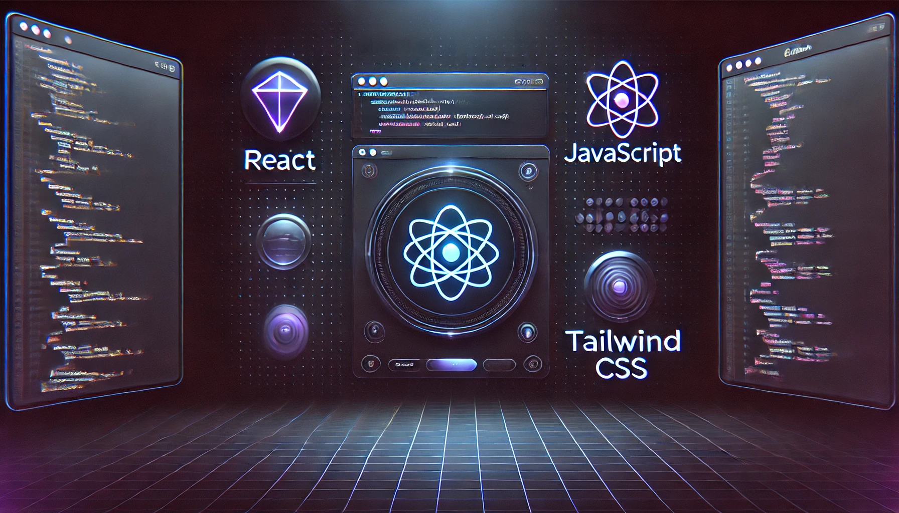

<h1 align="center">
  
</h1>

  
  

---

## **💡 About Me**
- 🔥 Passionate about web development and problem-solving.
- 🚀 Building **a Mock Interview Website** to help students improve coding skills.
- 🎯 **Competitive Programmer** (solving on Codeforces, Leetcode, etc.).
- 🌱 Learning **backend optimizations & database management**.
- 🎨 I love creating **visually appealing and functional UIs**.

---

## 🌱 Current Activities
- 🚀 Working on a **Mock Interview Website** to help students improve their coding skills.
- 💻 Solving problems on **Codeforces, Leetcode, and other platforms**.
- 📚 Learning advanced backend optimizations and database management.

---

## **🚀 Tech Stack**

  

---

## **🏆 GitHub Achievements**

  

---

## **📊 GitHub Stats**

  
   
  

### **📌 Most Used Languages**

  

---

## **🔥 GitHub Contribution Graph**

  

---

## **📌 Pinned Repositories**

  
   
  <b>LearnMate:</b> A platform designed to enhance education by fostering collaboration, simplifying complex concepts, and bridging the gap between students and knowledge.
    

  
   
  <b>Sporty:</b> A sleek and responsive e-commerce site for sports equipment, designed with an intuitive UI and seamless shopping experience.
    

  
   
  <b>CareerPath:</b> A career counseling platform that provides guidance and resources for students and professionals to make informed career choices.

---

## **📬 Connect With Me**

  
  
  

