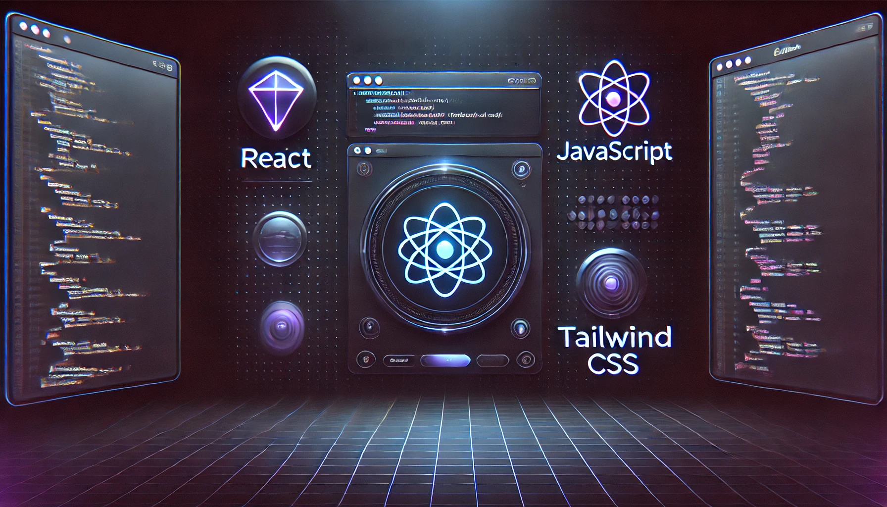

# Adnan Sami
**Frontend web Developer**

## About Me
- Passionate about web development and problem-solving.
- Experienced in building full-stack applications using modern technologies.
- Competitive programmer with a strong grasp of algorithms and data structures.
- Continuously learning and exploring new technologies.

## 🌱 Current Activities
- 🚀 Working on a **Mock Interview Website** to help students improve their coding skills.
- 💻 Solving problems on **Codeforces, Leetcode, and other platforms**.
- 📚 Learning advanced backend optimizations and database management.

## 🚀 Skills
### Frontend:

  
  
  
  

### Backend & Database:

  
  

### Competitive Programming:

  

## 🔗 Connect With Me

## 📊 GitHub Stats

## 📌 Pinned Repositories

